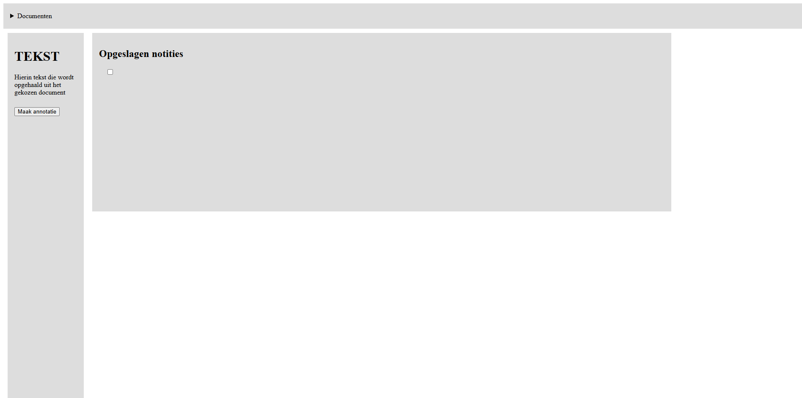
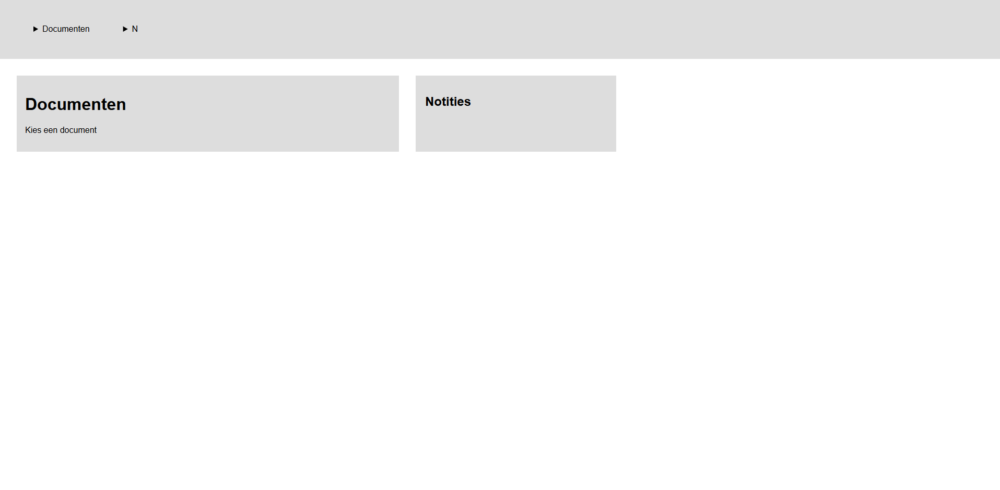

# Dag 01 (30-03-2026)
## Aantekeningen opdracht
### Team Roger
Roger studeert filosofie en hij wil graag annotaties kunnen maken in de (digitale) boeken die hij leest, en die annotaties makkelijk terug kunnen vinden.
Roger heeft maculadegeneratie. Hij kan steeds slechter zien en is nu op het punt dat hij echt niet meer zonder screen reader kan.

Ik wil iets maken dat Roger iets kan markeren ("dit stuk is belangrijk"), een notitie kan inspreken (of typen als hij dat kan) en dat hij alles kan terugluisteren per boek en/of thema.

Markeren moet gedaan worden met geluid. Bijv. "belangrijk", "twijfel", "quote", "idee", etc.

Met sommige toetsen bepaalde acties uitvoeren?

Een extra kopje/tabblad maken waar Roger kan terugvinden wat hij heeft gemarkeerd.
Bijv. de woorden: "belangrijk", "twijfel", "quote". En dan kan Roger aan de computer vragen "toon alles waar ik "quote" dacht".

Screenreader leest het voor. Gebruiker moet dan terug kunnen gaan en met een toets kunnen ... wat hij wil markeren.

Ik moet (denk ik) rekening houden met:
Cursor van de muis
Tab

Ik moet mezelf gaan verdiepen in aria-label en aria-live

Vasilis vertelde:
Met aria-live attribuut kan je met JavaScript stukken tekst voorlezen, na de gebruiker iets heeft geselecteerd.
Wat er dan wordt gezegd schrijf jij met dit attribuut

### Vragen voor ontmoeting:
Hoe lees en markeer je boeken nu met de screenreader?

Welke screenreader(s) gebruik je?

Spring je per paragraaf of zin?

Gebruik je bookmarks?

Hoe maak je nu notities en hoe/waar bewaar je die?

Wat merk je dat nu frustrerend of niet fijn is met het gebruiken?

Hoe vind je iets terug in de tekst?

Is er nog iets dat je visueel kan zien, wat zou kunnen helpen, of zie je echt niks?

Hoe gebruik je je toetsenbord? Lees/gebruik je braille?

## Weekly Geek
Artikel Exclusive design en Flipping things gelezen.
Exclsuive design:
Auteur: Vasilis van Gemert
Jaar: 2017 (waarschijnlijk) (pagina biografie = 18-01-2009)

De afgelopen 25 jaar zijn website vooral ontworpen voor mensen, zoals ontwerpers zelf. Die de computer op een gelijke manier kunnen gebruiken.

De auteur vraagt zich af wat er gebeurt als je juist websites ontwerpt voor mensen met een beperking.
Deze vraag stelde hij tijdens zijn master Design aan de Willemm de Kooning Academie in Rotterdam.

Tijdens zijn onderzoek kwam hij erachter dat precies het tegenovergestelde van inclusive design principles hem hierbij zal verder helpen.

Exclusive design prinicples:
- Study situation
    Als ontwerper weet je niet genoeg over de belevingswereld van mensen met een beperking.
    Daarom moet je concreet en individueel kijken. In welke situaties gebruiken mensen een website en hoe gebruiken zij die.
    Welke obstakels komen ze tegen en hoe kan je deze oplossen? (UX)
- Ignore conventions
    Webdesign heeft veel vaste "gewoontes", bijv. menu's altijd bovenaan.
    Dit is handig voor de "gemiddelde" gebruiker, maar kunnen een persoon met een beperking juist tot last zijn.
    Dus inplaats van blind volgen wat "normaal" is moet je kijken wat logisch en bruikbaar is voor andere gebruikers.
- Prioritise identity
    Hier betrek je de mensen met de beperking bij het maken van je website.
    Je ontwerpt niet alleen voor hen, maar met hen.
    Met hun ervaringen en voorkeuren schrijf je de website
- Add nonsense
    Dit gaat over het creatief zijn.
    Soms werken de raarste ideeën juist heel goed.

Waaromm de auteur dit wil onderzoeken en maken is: Omdat het kan

Flipping things:
Auteur: Vasilis van Gemert
Jaar: 2017 (waarschijnlijk)

In 2017 vroeg de auteur Léonie Watson om een gastlezing te geven over pleasurable user interfaces voor mensen die blind zijn.

Helaas kon Léonie de vraag niet beantwoorden
Uit het gesprek bleek dat de plezierige interfaces voor blinde gebruikers betekent dat iets gewoon werkt. Dit laat een kloof zien tussen hoe ontwerpers denken over goede interfaces en hoe mensen met een beperking deze ervaren.

Om deze reden onderzoekt de auteur de Inclusive Design Principles. Hij test wat er gebeurt als je deze "flipt".
Er ontstaan dan 4 nieuwe principes:
- Consider all contexts -> Study situation
    Inplaats van alles theoretisch mee te nemen, moet je juist diep in speciefieke situaties van gebruikers duiken.
- Be consistent -> Ignore conventions:
    Bestaande ontwerpen werken niet altijd voor iedereen, dus moet je ze loslaten
- Prioritise content -> Prioritise identity:
    Niet alleen content is belangrijk, maar ook de identiteit en ervaring van gebruikers zelf.
- Add value -> add nonsense:
    Door gekke ideeën toe te laten, kunnen juist gode inzichten ontstaan.

Het gaat erom dat veel standaard designprincipes uitgaan van aannames die niet altijd kloppen voor mensen met een beperking.

14 april kan ik niet aanwezig zijn.
Een kennis van me is blind in haar rechteroog en slechtziend links.
Van Vasilis heb ik toestemming gekregen om die keer mijn app met haar te testen.
De andere 3 keer doe ik wel met Roger in de klas.

## Checkout
Besproken met Braham

## Wat heb ik gedaan vandaag?
Voor mezelf bedacht en opgeschreven wat ik zou willen maken voor Roger.
Vragen bedacht die ik hem morgen kan stellen.

## Hoe lang duurde het?
Van +/- 09:15 tot 16:30

## Wat heb ik geleerd?
Geleerd dat niet iedereen even makkelijk een website kan gebruiken.
Hoe normaal gesproken websites worden gebouwd kan een screenreader juist hinderen, waardoor het voor de gebruiker lastiger is.
Dat ik moet gaan werken met ARIA. Hier moet ik me meer in gaan verdiepen

## Wat ga ik morgen doen?
Morgen kennis maken met Roger.
Hem de vragen stellen die ik heb.

Mezelf verdiepen in ARIA.

# Dag 02 (31-03-2026)
## Checkout
Vandaag is er geen checkout i.v.m. de testmomenten

## Wat heb ik gedaan vandaag?
Vanochtend de weekly geek
Daarna moeten wachten tot het gesprek. Deze tijd heb ik benut voor een herkansing van de pabo.

Om 14:00 het gesprek met Roger.
Roger is 59. Wordt 60 dit jaar
Was 43 toen hij dacht ik zie wat waziger
Drukke baan bij rijksoverheid
Toch maar langs de opticien
Doorverwezen en uitslag. Het netvlies gaan door een erfelijke aandoening kapot (kegeltjes)
Al snel kon hij niet meer lezen
Baan verloren door dit. Autorijden niet meer
Doet vrijwilligerswerk
Hij doet nu nieuwe opleiding. Studeerd nu filosofie.

Roger kan kleuren zien. Vroeg of laat worden de kleuren wel aangetast

Zijn brein vult het gat in, maar dat betekent niet dat het juist is wat hij ziet

Hij ziet als het ware met een vuist voor zijn gezicht.

Op zijn telefoon heeft hij een voice over. Door twee keer te tikken op de achterkant van zijn telefoon gaat deze aan of uit.

Hij wil studieboeken kunnen toevoegen en daarbij aantekeningen maken. Net zoals wij dat met plakkertjes doen.
En ook dat hij z'n aantekeningen terug kan vinden

Buitenkanten van een website kan hij zien, maar niet het midden van een zin.
Hij kan twee zinnen lezen en dan houdt het ook qua energie op
Hij ziet één grote blur

Hij is gevoelig voor witlicht. (website in darkmode)

Hij maakt nu nog aantekeningen met pen en papier.
Door krabbeltjes te maken kan hij dingen onthouden.
Soms neemt hij aantekeningen op. Maar niet iedereen vindt dit fijn
Aantekening knopjes zoals bij word vindt hij erg lastig, vooral het terug vinden
Voorkeur voor aantekeningen is auditief.

Het krijgen van studieboeken in word is enorm lastig (en aantekeningen maken)
(Dit wil hij hebben. Het juiste bestand kunnenn krijgen en aantekeningen maken)

Voor aantekeningen zit hij achter zijn computer
Niet op tel. Wil wel graag op tel aantekeingen kunnen maken

Supernova en nvd(?) op laptop

Wil aantekeningen koppelen aan het boek.
Dus in een lijst boek kunnen terug vinden en daarin de aantekeningen

Hij kan enigszins blind typen

Tabben of wat anders per zin is fijner dan per paragraaf

## Hoe lang duurde het?
Van +/- 09:20 tot

## Wat heb ik geleerd?
Geleerd hoe Roger de wereld ziet en het web gebruikt.
We konden hem veel vragen.

4 studenten hadden wat kleins gemaakt en lieten dit testen. Hier kwam ook nuttige informatie uit.

## Wat ga ik morgen doen?
Morgen hebben we de eerste API les

# Extra (02-04-2026)
Schets in Figma gemaakt
<a href="./media/schets_hcd.png" alt="schets_hcd">

## Bronnenlijst:
Exclusive Design https://exclusive-design.vasilis.nl/
mdn - WAI-ARIA Roles https://developer.mozilla.org/en-US/docs/Web/Accessibility/ARIA/Reference/Roles#:~:text=ARIA%20roles%20are%20added%20to,in%20association%20with%20other%20roles.

# Extra (04-04-2026)
De schets in Figma geprobeerd na te maken.
Dit was toen het resultaat begin van de middag: 

# Dag 03 (07-04-2026)
## Checkout
Besproken met

## Wat heb ik gedaan vandaag?
Zaterdag had ik enigszins de layout gemaakt.
Ik had toen het gedeelte van "notities" laten verschijen met has() (net als met bt)
Ik denk dat het beter is als ik hier ook een details van maak, net als "documenten"

## Hoe lang duurde het?
Van +/- 09:15 tot

## Wat heb ik geleerd?

## Wat ga ik morgen doen?

## Bronnenlijst:
Tetra Logical - Accessibility and the agentic web https://tetralogical.com/blog/2025/08/08/accessibility-and-the-agentic-web/

# Voortgangsgesprekken
## 02-04-2026
Deze week had ik alleen kennisgemaakt met Roger en vragen gesteld.
Ik vond het erg lastig om wat te bedenken, maar na het gesprek met Leonie heb ik meer kennis met wat ik kan en wil doen.

Op advies heb ik NVDA gedownload om dat er altijd bij te kunnen houden. Zo weet ik ongeveer hoe Roger het ervaart.

Leonie zei dat aria roles handig is. Daar wil ik me in gaan verdiepen

# Volledige bronnenlijst:
Vasilis.nl - Exclusive Design (2019). Geraadpleegd op 30-03-2026 van <a href="https://exclusive-design.vasilis.nl/">

Vasilis.nl - Flipping things (2019). Geraadpleegd op 30-03-2026 van <a href="https://exclusive-design.vasilis.nl/flipping-things/">

mdn - WAI-ARIA Roles (2025). Geraadpleegd op 02-04-2026 van <a href="https://developer.mozilla.org/en-US/docs/Web/Accessibility/ARIA/Reference/Roles#:~:text=ARIA%20roles%20are%20added%20to,in%20association%20with%20other%20roles.">

Tetra Logical - Accessibility and the agentic web (2025). Geraadpleegd op 06-04-2026 van <a href="https://tetralogical.com/blog/2025/08/08/accessibility-and-the-agentic-web/">
